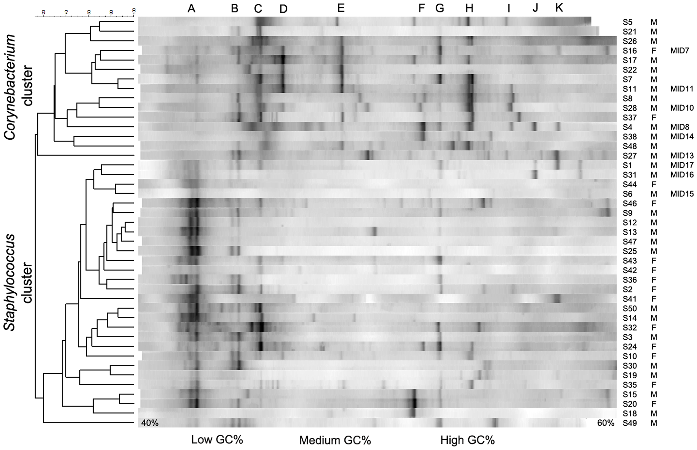

# Inleiding

link naar playlist met kennisclips:
[Kennisclips Hoofdstuk1](https://www.youtube.com/playlist?list=PLZH1hP8_LbJIk4G2AZYYKvgZLjRR-1-Iw)

link naar webpage/script die wordt gebruik in de kennisclips: [script Hoofdstuk1](https://statomics.github.io/sbc/rmd/01-intro.html)

<iframe width="560" height="315" src="https://www.youtube.com/embed/nm_yvgAXvyA" frameborder="0" style="display: block; margin: auto;" allow="autoplay; encrypted-media" allowfullscreen></iframe>

De meeste vragen in de levenswetenschappen kunnen slechts beantwoord worden door gegevens te verzamelen en te analyseren, bijvoorbeeld:

- Voor welke genen verschilt het expressieniveau in kanker en normaal weefsel?
-  Kwaliteitscontrole: wijkt de concentratie van een chemisch product af van wat er op het label wordt vermeld?  
-  Wat is de invloed van regelmatig joggen op bloeddruk?
-  Is er een relatie tussen zweetgeur en de samenstelling van de microbiële gemeenschap onder de oksel?

Bij onderzoek naar biologische processen moet men zich realiseren dat uitkomsten aan variatie onderhevig zijn. Aspirine is bijvoorbeeld niet bij iedereen even effectief om hoofdpijn te verzachten zodat de uitkomst voor een persoon met en zonder inname van aspirine meestal niet exact te voorspellen valt. Dit wordt mede veroorzaakt door het feit dat mensen verschillen in gewicht, ziektegraad, gevoeligheid voor een stof, ... Bovendien reageert een persoon vaak anders op een stof naargelang hij moe of uitgerust is, het middel ’s morgens of ‘s avonds inneemt, voor of na het eten, op geregelde tijdstippen of met onregelmatige intervallen, ... En zelfs al mocht een bepaalde stof voor iedereen even effectief zijn, dan nog is het zo dat verschillende metingen voor een zelfde persoon zelden gelijk zijn.
De aanwezigheid van die biologische variabiliteit is bijzonder opvallend in de context van roken: de schadelijke gevolgen van roken op longkanker en hartaandoeningen zijn intussen goed gekend, maar nagenoeg iedereen kent wel iemand die gans zijn leven gerookt heeft en desondanks meer dan 80 jaar oud geworden is.

Precies omwille van die biologische variabiliteit is het moeilijk om wetenschappelijke vragen goed te beantwoorden en zal men zelden onmiddellijk het antwoord zien na het bekijken van ruwe gegevens. Onderzoekers in de fysiologie, bijvoorbeeld, gaan vaak na wat het effect is van een bepaalde substantie (bijvoorbeeld, een geneesmiddel, hormoon of toxine) op experimentele dieren (bijvoorbeeld, ratten of ook in vitro weefselpreparaten). Dit effect wordt bestudeerd door verschillen in respons te meten tussen dieren geïnjecteerd met de substantie en controledieren die werden geïnjecteerd met een inactieve zoutoplossing. Omwille van biologische variatie zullen een aantal dieren die geïnjecteerd werden met lage dosissen van de toxische stof, het er vaak beter van af brengen dan sommige controledieren. Hierdoor kunnen geobserveerde effecten zowel toevallig zijn als wijzen op een systematisch effect. Bovendien moeten we ons afvragen of de controlegroep en de met substantie-geïnjecteerde groep een vergelijkbare gezondheid hebben. Zo niet, dan zou een mogelijk verschil in respons ook mede hierdoor verklaard kunnen worden.

Het doel van statistiek is precies om orde te scheppen in de chaos door duidelijk te maken hoeveel variatie op de gegevens toe te schrijven valt aan systematische verschillen (bijvoorbeeld, door het al dan niet inspuiten van een bepaalde substantie) en hoeveel aan toeval of biologische variatie.

Statistiek is immers de wetenschap rond verzamelen, exploreren en analyseren van data.  Ze laat toe

- om tot een goede proefopzet te komen,
- om te leren uit data en
- om hierbij variabiliteit en onzekerheid te
    - kwantificeren
    - controleren
    - rapporteren

- d.m.v. statistische besluitvorming modellen op een formele wijze te toetsen aan de data.

Ze vervult daarom een belangrijke rol in zowat alle wetenschappen. Zie onder meer de populaire column ''points of significance'' in Nature Methods. (http://blogs.nature.com/methagora/2013/08/giving_statistics_the_attention_it_deserves.html)

In deze inleiding situeren we Statistiek in de Wetenschappelijke Methode.

## De Wetenschappelijke Methode {#sec:wetMeth}

Het doel van wetenschap is het begrijpen van de natuur (van het allerkleinste tot het allergrootste, van vroeger en nu tot in de toekomst). De *Wetenschappelijke Methode* is de methodiek die vandaag de dag algemeen aanvaard wordt om onze wetenschappelijke kennis van de natuur op te bouwen. Twee belangrijke pijlers van de Wetenschappelijke Methode zijn theorie en observatie. Een wetenschappelijke theorie voorspelt hoe een natuurlijk proces zich gedraagt. Observaties kunnen gebruikt worden om deze theorie te bevestigen of te ontkrachten. Een wetenschappelijke theorie kan dus nooit bewezen worden door observatie, maar kan wel ontkracht worden door observatie. Dit is het *falsificatieprincipe* van de wetenschapsfilosoof Karl Popper (1902-1994).

De levenswetenschappen berusten op empirisch onderzoek omdat observaties nodig zijn om de kennis uit te breiden. Theorieën kunnen gepostuleerd worden zonder observatie (hoewel dit zelden gebeurt), maar de wetenschapsgemeenschap neemt ze typisch maar voor waar aan nadat de nieuwe theorieën aan observatie getoetst worden.

Figuur \@ref(fig:wetMet) is een schematische weergave van de Wetenschappelijke Methode.

- De *natuur* staat bovenaan de driehoek. Dit stelt het universum, de wereld, de werkelijkheid of de *waarheid* voor, waarover de mens kennis wil verzamelen.

- Een *model* (of een *theorie*) stelt een denkbeeld van een aspect van de natuur voor. Een model laat toe om voorspellingen, verder *predicties* genoemd te maken over het gedrag van een aspect van de natuur. Hierbij wordt niet noodzakelijk een mathematisch model bedoeld, maar kan het ook een kwalitatieve beschrijving zijn van een aspect van de natuur (bv. insecticide behandeling van planten leidt tot een vermindering van het aantal schadelijke insecten op de planten en tot een verhoogde opbrengst van de oogst).

- Via een *wetenschappelijk experiment* worden *data* uit de *natuur* gehaald. Data vormen een manifestatie van het werkelijke gedrag van de natuur. Het experiment moet *representatief* en *reproduceerbaar* zijn

- *Statistische Besluitvorming* (Engels:  *statistical inference*) vormt de brug tussen het model van de natuur en de data uit de natuur. *Statistische Besluitvorming* laat toe op een formele wijze het model te toetsen aan de data en te besluiten in welke mate de wetenschappelijke gemeenschap de theorie en het model voor waar mag aannemen.

- Statistiek wordt ingeroepen omdat de *Wetenschappelijke Methode* niet zonder doel gebruikt wordt. Wetenschappers hebben gedeeltelijke kennis van de natuur via een aantal modellen/theorieën, maar deze kennis doet nieuwe vragen ontstaan. Dit leidt tot een nieuwe *onderzoeksvraag* (bijvoorbeeld: zorgt het gebruik van insecticiden voor minder schade van insecten aan de plant?), welke vervolgens verfijnd wordt in een nauwkeurig geformuleerde *hypothese* (bijvoorbeeld: Het aantal aangetaste bladeren is gelijk voor onbehandelde en pesticide-behandelde planten). Een hypothese is zodanig geformuleerd dat ze door data kan verworpen worden indien de hypothese niet waar zou zijn. De formulering van de hypothese bepaalt mede hoe het *experiment* moet opgezet worden om de meest informatieve data (evidentie) te kunnen bekomen om vervolgens via de *statistische besluitvoering* tot een *conclusie* (i.e. antwoord op de onderzoeksvraag) te komen. Statistiek als wetenschapdiscipline treedt dus op in drie domeinen:
    1. *Proefopzet ("Experimental Design"):* het ontwerpen van het experiment,
    2. *Data-exploratie en beschrijvende statistiek ("Data-exploration and Descriptive Statistics"):* het exploreren, samenvatten en visualiseren van de data en
    3. *Statistische besluitvorming ("Statistical Inference"):* het veralgemenen van de resultaten in de steekproef naar de populatie toe.

We komen nog even terug op het falsificatieprincipe. Doorheen deze cursus zal het duidelijk worden dat statistiek methoden aanlevert die toelaten om na te gaan in welke mate data consistent zijn met een vooropgestelde model. Indien de data consistent zijn met het model zullen we niet noodzakelijk onmiddellijk besluiten dat de theorie en het model correct zijn. De wijze waarop de data tot stand gekomen zijn via de opzet van experiment speelt hierbij ook een belangrijke rol. Het experiment moet eigenlijk zo opgezet worden dat het model uitgedaagd wordt. Pas als alle moeite gedaan is om te pogen data te bekomen die inconsistent zijn met het model, kunnen de theorie en het model als waar beschouwd worden met een grote waarschijnlijkheid. Wanneer de data inconsistent zijn met het gepostuleerde model, dan kan direct besloten worden dat het model niet juist is.

De *Wetenschappelijke Methode* heeft een cyclisch karakter: bij het vaststellen van een foutief model zal de wetenschapper het model aanpassen en doorloopt hij opnieuw alle stappen van de *Wetenschappelijke Methode*.

```{r wetMet, fig.cap='De Wetenschappelijke Methode en de rol van Statistiek.', out.width='100%', fig.asp=.8, fig.align='center',echo=FALSE}
par(mar=c(0,0,0,0))
plot(c(0,1,2,0),c(0,sqrt(3),0,0),type="l",xaxt="none",yaxt="none",xlab="",ylab="",axes=FALSE,xlim=c(-1,2.7),ylim=c(-1,sqrt(3)+.5))
text(c(0,2.2),rep(sqrt(3)/2,2),c("Theorie","Experiment"),col="darkred",cex=2)
 text(c(1,2.2,-.3,1),c(sqrt(3)+.3,rep(-.15,2),-.1),c("Natuur","Data","Model","Statistische\n besluitvorming"),cex=2,pos=1,col=c(rep("black",3),"darkred"))
```


Een andere belangrijke rol van de Statistiek die verder in deze cursus wordt behandeld, is om de *reproduceerbaarheid* van wetenschappelijk onderzoek te waarborgen, binnen zelf gekozen probabiliteitsgrenzen (onzekerheid / zekerheid).

## Opzet van de cursus

We leven in een tijd van big data en het is cruciaal om informatie uit cijfers te kunnen extraheren. Statistiek is nu net de wetenschap om te leren uit empirische gegevens.

Statistische geletterdheid is dus een noodzaak om de resultaten uit deze analyses in wetenschappelijke tijdschriften of in de media kritisch te kunnen interpreteren.

Hierbij is het belangrijk om inzicht te verwerven in statistische data analyse enerzijds en om anderzijds deze analyse te interpreteren. We moeten de analyse m.a.w. kunnen koppelen aan de context van het onderzoek: de onderzoeksvraag, de proefopzet en de eigenschappen van de data.
Daarom gaan we alle statistische methodes in de cursus aanbrengen aan de hand van case studies.
We gaan hierbij steeds stilstaan bij

1. de proefopzet en context van de studie (experimenteel ontwerp),

2. eigenschappen van de ruwe data (data exploratie), en

3. hoe we de resultaten uit de steekproef kunnen veralgemenen naar de populatie toe (statistische besluitvorming).

4. Om statistische geletterdheid te verwerven is het ook cruciaal om zelf eenvoudige statistische analyses uit te kunnen voeren zodat je data leert analyseren en te interpreteren. We zullen dus ook in elke case study stilstaan bij hoe we de data analyse uit moeten voeren in statistische software.

In de cursus maken we hiervoor gebruik van
het statistische software pakket R. De cursus en de case studies werden volledig in rmarkdown aangemaakt, dit zijn geavanceerde scripts die toelaten om

- tekst
- formules
- code en
- R output en plots

op een efficiënte manier te combineren. Het rmarkdown script kan dan worden gecompileerd naar een webpagina of een pdf document. Op deze manier kan je een data analyse op een volledig reproduceerbare manier documenteren. De scripts van de cursus vormen een goede inspiratiebron om zelf met rmarkdown aan de slag te gaan.

De cursus wordt volledig in online leerpaden verzorgd op het platform Dodona.
Daarbij gaan we hand-on leren statistische programmeren in 2 modules:

1. Module: Introduction to R, waarbij jullie interactief kennis maken met het statistische software pakket en programmeer taal R. Week 1 - Week 3.

2. Module: Data exploration and visualisation waarbij jullie de basis principes zullen leren van het maken van goede grafieken die je inzicht zullen geven in de data die wordt gegenereerd in het experiment. Week 4 - 5.

3. Module: Statistiek, het hart van deze cursus, waarin jullie inzicht zullen verwerven in de drie belangrijke takken van de statistiek. Week 1-12.
    - proefopzet ook wel experimental design genoemd,
    - data exploratie
    - statistische besluitvorming ook wel inferentie genoemd.

Hierbij staat steeds een echte dataset centraal zodat jullie de vertaalslag leren maken van de onderzoeksvraag naar statistisch modellen toe om dan na de data analyse de resultaten opnieuw te interpreteren in termen van de onderzoeksvraag.

We zullen ook telkens alle code delen die nodig is om alle data analyses en visualisaties uit te voeren die worden weergegeven in deze cursus.

In deze inleiding introduceren we drie case studies die het belang van statistiek illustreren.


1. Case study I: Het oksel microbiome. In deze case study doorlopen we alle belangrijke stappen van een experimentele study.

2. Case study II: Verschil in lichaamslengte tussen vrouwen en mannen. In deze studie zal je inzicht verwerven in hoe observaties, resultaten en conclusies van een studie onderhevig zijn aan variabiliteit.

3. Case study III: Salk vaccin studie voor polio. Deze studie illustreert het belang van een goede controle en introduceert het concept van confounding.

Tijdens de eerste lezing van dit hoofdstuk is het nog niet belangrijk om te focussen op de code. Probeer vooral inzicht te verwerven in het theoretisch raamwerk dat wordt geïntroduceerd. Na week 4 kan het nuttig zijn om de case studies nog eens door te nemen met het oog op hoe je de analyses concreet uit kan voeren.

## Case study: oksel microbiome


<iframe width="560" height="315" src="https://www.youtube.com/embed/HkMCq3IBvRI" frameborder="0" style="display: block; margin: auto;" allow="autoplay; encrypted-media" allowfullscreen></iframe>

https://www.vrt.be/vrtnws/nl/2018/10/22/gezocht-mensen-met-penetrante-lijfgeur-om-probiotische-deodor/

<iframe width="560" height="315" src="https://youtube.com/embed/9RIFyqLXdVw" frameborder="0" style="display: block; margin: auto;" allow="autoplay; encrypted-media" allowfullscreen></iframe>


Zweten en vooral een zweetgeur is vervelend.
Het zweten op zich is niet de oorzaak van de geur.
Het zijn de microorganismen onder de oksel die het zweet metaboliseren die de geur veroorzaken.
De samenstelling van de gemeenschap van microorganismen onder de oksel is dus bepalend voor het hebben van een zweetgeur.
Deze gemeenschap wordt ook het oksel microbiome genoemd.

Corynebacterium is een bacterie die zweet metaboliseert en hierbij verzadigde vetzuren aanmaakt met een penetrante geur.
Gelukkig zijn er Staphylococcus bacteriën die het zweet ook metaboliseren maar die hierbij geen hinderlijke verzadigde vetzuren produceren.

Het CMet Lab aan de Universiteit Gent doet onderzoek naar microbiële gemeenschappen en stelde een therapie voor om mensen van dit probleem af te helpen.
Die bestaat uit een antibiotica behandeling van de oksel om het microbiome af te doden,
gevolgd door een transplantatie van het microbiome van een persoon zonder zweetgeur.

Alvorens de therapie breed kan worden ingezet, dient eerst te worden aangetoond in een experiment dat ze werkt.

<!---break-->

### Experimenteel design (proefopzet)


<iframe width="560" height="315" src="https://www.youtube.com/embed/0CUL9DaY-bw" frameborder="0" style="display: block; margin: auto;" allow="autoplay; encrypted-media" allowfullscreen></iframe>

Een eerste tak van de statistiek focust op experimenteel design.
Idealiter zouden we de therapie evalueren door het uit te testen op de volledige populatie van personen met een zweetgeur.
Dat is echter niet haalbaar omdat het

1. ethisch niet verantwoord is: we weten niet of therapie werkt
2. financieel en logistiek onmogelijk is om iedereen te bemonsteren, en omdat
3. de populatie waarover we uitspraken wensen te doen bestaat nog niet volledig: ze omvat ook toekomstige personen met een zweetgeur.

Daarom zullen we een steekproef nemen.
Hierbij zullen we een aantal personen uit de populatie selecteren waarop we het experiment uit zullen voeren.

Cruciaal is hierbij dat de steekproef representatief is voor de populatie zodat we de resultaten van het experiment zullen kunnen veralgemenen naar de populatie. We zullen de mensen daarom volledig at random trekken uit de populatie zodat elk subject een zelfde kans heeft om in het experiment te worden opgenomen: aselecte steekproeftrekking (random sampling uit de populatie).
Merk ook op dat het daarom heel belangrijk is om de populatie goed te omschrijven voor de start van het experiment: scope van de studie.

In deze studie worden twintig personen met een zweetgeur volledig at random geselecteerd uit de populatie.
We zouden nu elk subject kunnen behandelen.
Maar, dan zijn we niet zeker dat een verschil in het microbiome te wijten is aan de behandeling.

We hebben dus een goeie controle nodig.
We zouden de controle personen niet kunnen behandelen, maar dan kan een verschil in microbiome mogelijks ook te wijten zijn aan de antibiotica behandeling i.p.v. aan de transplantatie.
De onderzoekers opteerden daarom 10 personen een placebo behandeling geven, enkel antibiotica behandeling en 10 personen te behandelen met antibiotica en de transplantatie.

De proefpersonen worden volledig at random toegewezen aan de behandelingsgroep zodat beide groepen vergelijkbaar zijn.


Vervolgens moet er stil worden gestaan bij hoe het microbiome zal worden gemeten.

In de studie maakte men gebruik van een DGGE meting.
Microorganismen hebben een heel variabel stukje ribosomaal RNA, het 16s ribosomaal RNA dat uniek is voor de soort.
Het 16S rRNA van de verschillende microorganismen in het staal wordt dan geamplificeerd en gescheiden op een DGGE gel.
Waarbij een bandenpatroon ontstaat volgens de lengte van het 16s rRNA.


{width=70%}
Foto van een DGGE gel van het oksel microbiome (bron: https://doi.org/10.1371/journal.pone.0070538)

Elke band in de DGGE correspondeert met een bacterie.
Hoe helderder de band hoe meer van de bacterie in het microbiome voorkomt.
Band A staat voor Staphylococcus.
De ratio van de intensiteit van de band en de totale intensiteit in het bandenpatroon kan worden gebruikt als een proxy voor de relatieve abundantie.

*Essentiële stap: Vertaal onderzoeksvraag nu naar iets wat we kunnen quantificeren!*

We kunnen dit doen door middel van het gemiddeld verschil in relatieve abundantie in Staphylococcus tussen de transplantatie en placebo groep.

Het experiment kan nu worden uitgevoerd.

<!---break-->

### Data exploratie en beschrijvende statistiek


<iframe width="560" height="315" src="https://www.youtube.com/embed/nN25owSaS2A" frameborder="0" style="display: block; margin: auto;" allow="autoplay; encrypted-media" allowfullscreen></iframe>

Data exploratie is heel belangrijk om inzicht te krijgen in de data en is een essentiële eerste stap om te leren uit data.
Het wordt vaak ondergewaardeerd of over het hoofd gezien.

Data in deze cursus wordt verwerkt via het statistisch software pakket R.
Vooraleer we met de data exploratie van start kunnen gaan moeten we de data eerst importeren in R.

We geven duidelijk aan welke delen van de tekst over het Code gaan en welke over de interpretatie. Probeer initiëel te focussen op de interpretatie. Het Code zal je immers gedurende de eerste weken oppikken. Daarom hebben we ook gekozen om aparte clips te maken m.b.t interpretatie en Code. Zodat de manier hoe je de data analyse dient uit te voeren het begrip initiëel niet in de weg staan.

#### Importeer de data

*Code* Tijdens de data exploratie gaan we voor de data manipulaties veelal gebruik maken van functies uit het `tidyverse` package.
Dat kan worden geladen door het commando
`library(tidyverse)`.

Via het commando `read_lines` kunnen we enkele regels van een data bestand inlezen om de structuur van het data bestand te weten te komen.

```{r}
library(tidyverse)
read_lines("https://raw.githubusercontent.com/statOmics/sbc/master/data/armpit.csv")
```

We observeren de volgende structuur:

- Gegevens in het bestand zijn door comma's gescheiden.
- Elke rij bevat de gegevens voor 1 proefpersoon
- Verschillende variabelen worden gemeten per persoon en zijn van elkaar gescheiden door een comma. Het bestand is in csv formaat: "comma separated values".
- We kunnen bestanden met dit formaat inlezen R via het commando `read_csv`.
- We slaan de data op in R in het object met naam ap. Hiervoor gebruiken we de `<-` operator.
- We geven de data tabel terug door het object aan te roepen door zijn naam te typen.

```{r}
ap <- read_csv("https://raw.githubusercontent.com/statOmics/sbc/master/data/armpit.csv")
ap
```

Als we data matrix observeren zien we de volgende structuur:
proefpersonen in de rijen waarvoor we twee karakteristieken (variabelen) hebben bijgehouden per subject:
behandeling (trt) en relatieve abundantie (rel).
Deze data structuur wordt `tidy data` genoemd.

Weinig mensen kunnen a.d.h.v. het bekijken van de data matrix structuur of patronen zien in de data. Daarom zullen we de data moeten verwerken en visualiseren.  


#### Beschrijvende statistiek

In artikels en de media worden resultaten uit een steekproef vaak gerapporteerd a.d.h.v. gemiddelde en de standaardafwijking.

*Code*

- We vatten de data eerst samen. We berekenen het gemiddelde en de standaard deviatie (een maat voor de spreiding, zie volgende hoofdstukken).
We slaan het resultaat hiervan op in het object apRelSum via `apRelSum <-`.

1. We pipen (via `|>`) het `ap` dataframe naar de `group_by` functie om de data te groeperen per treatment trt: `group_by(trt)`.

2. We pipen het resultaat naar de `summarize_at` function om de "rel" variable samen te vatten en berekenen hierbij het gemiddelde en standaardafwijking. Omdat we de data eerst hebben gegroepeerd zullen we het gemiddelde en de standaard deviatie berekenen per groep.


```{r}
apRelSum <- ap |>
  group_by(trt) |>
  summarize_at("rel",
               list(mean=mean,
                    sd=sd
                    )
                )
```

We tonen vervolgens het resultaat door het object apRelSum aan te roepen

```{r}
apRelSum
```

We kunnen ook een tabel in de webpagina of het pdf bestand integreren via het commando kable van het knitr pakket:

```{r}
knitr::kable(apRelSum, tableType)
```

*Interpretatie*

Het effect van de behandeling in de steekproef kan worden gekwantificeerd door de gemiddelde relatieve abundantie te vergelijken in elke steekproef. We observeren dat de gemiddelde relatieve abundantie in de steekproef gemiddeld `r round(apRelSum$mean[2]-apRelSum$mean[1],1)`% hoger is in de transplantatie dan in de placebo groep.

We quantificeren ook de variabiliteit of de spreiding van de gegevens rond het gemiddelde aan de hand van de standaardafwijking.

Het gemiddelde en de standaardafwijking wordt ook vaak grafisch weergegeven in een barplot.

*Code*
We maken in deze cursus gebruik van het pakket `ggplot2` om grafieken te maken.  
Met de ggplot2 bibliotheek kunnen we gemakkelijk grafieken opbouwen in lagen (layers).
Hierdoor leest de code veel makkelijker.
Een uitgebreide introductie tot ggplot vind je in de Dodona module [R data exploration and visualisation](https://dodona.ugent.be/nl/courses/345/).

Bar plots worden heel veel gebruikt in artikels om resultaten weer te geven.

1. We pipen de samengevatte data naar de functie `ggplot`. Dat is de basis van elke ggplot.  We selecteren de variabele met de behandeling trt als x variabele en de variabele met naam mean als y-variabele voor de plot.
We doen dit steeds via de aesthetics `aes` functie.   `aes(x=trt,y=mean)`

2. We maken een barplot door een laag toe te voegen via de  `geom_bar` function. De statistiek is `stat="identity"` omdat de hoogte van de bar gelijk is aan de waarde voor y (hier het gemiddelde voor de relatieve abundantie).

3. We voegen foutenvlaggen toe om de onzekerheid op het gemiddelde weer te geven.  We doen dit via de `geom_errorbar` functie en specifiëren het minimum en maximum van de error bar. Het `width` argument wordt gebruikt om de breedte van de error bar smaller te maken dan deze van de bar.

```{r}
apRelSum |>
  ggplot(aes(x=trt,y=mean)) +
  geom_bar(stat="identity") +
  geom_errorbar(aes(ymin=mean-sd,ymax=mean+sd),width=.2)
```

*Interpretatie*

Is deze plot informatief? Nee!

We zien enkel een "two-number summary": het gemiddelde en de standaarddeviatie. We weten niet of deze wel een goeie samenvattende maat zijn voor de data. Bovendien wordt heel wat ruimte in de plot benut die niet informatief is: er zijn bijvoorbeeld geen observaties met relatieve abundanties van 0%.

Om de data van verschillende groepen makkelijk te kunnen vergelijken in een grafiek die meer informatief is dan de bar plot ontwikkelde Tukey de boxplot. Dit is een "five-number summary" het bereik van de data (minimum en maximum) samen met het 25, 50 (mediaan), en 75 percentiel. Deze percentielen zijn de waarden waarvoor respectievelijk 25%, 50% en 75% van de data in de steekproef kleiner zijn. Tukey raadde aan om het bereik van de data te berekenen zonder rekening te houden met outliers (extreme observaties). De outliers worden afzonderlijk als data punten toegevoegd aan de plot. In het hoofdstuk 4: Data Exploratie leggen we uit wat outliers precies zijn.


*Code*
We maken nu een boxplot voor de ap data

1. We pipen het `ap` data object naar `ggplot`
2. We selecteren de data voor de plot via `ggplot(aes(x=trt,y=rel))`
3. We voegen een laag toe voor de boxplot dmv de functie `geom_boxplot()`

```{r}
ap |>  
  ggplot(aes(x=trt,y=rel)) +
  geom_boxplot()
```


*Interpretatie*: De boxplot geeft ons al veel meer informatie dan de barplot. Het bereik van de data wordt weergegeven door de wiskers (eindpunten van de verticale lijnen in het midden van de boxplot). De box in de boxplot geeft het 25%, 50% en 75% percentiel weer. (Merk op dat er geen outliers zijn. Er worden geen individuele punten weergegeven in de plot)

We observeren dat de boxplot voor de transplantatie groep hoger ligt dan voor de placebo groep. Wat aangeeft dat de relatieve abundanties van Staphylococcus vaak hoger liggen voor personen in de steekproef die zijn toegewezen aan de transplantatie groep dan voor personen die zijn toegewezen aan placebo groep. Dit is een indicatie dat de behandeling werkt.

Verder weten we dat er maar 10 observaties zijn in elke groep. Dat laat toe om de ruwe gegevens aan de plot toe te voegen zonder dat de plot te druk wordt.

*Code*

- Merk op dat we het argument `outlier.shape` op NA (not available) zetten `outlier.shape=NA` in the `geom_boxplot` functie. Dat doen we standaard als we de ruwe data toevoegen aan de boxplots: anders zullen outliers immers twee keer worden weergegeven (eerst via de boxplot laag en daarna door de laag met alle ruwe data toevoegen aan de plot).
- We geven de ruwe data weer via de  `geom_point(position="jitter")` functie. We gebruiken hierbij het argument position='jitter' zodat we wat random ruis toevoegen aan de x-cordinaat zodat de gegevens elkaar niet overlappen.

```{r}
ap |>  
  ggplot(aes(x=trt,y=rel)) +
  geom_boxplot(outlier.shape=NA) +
  geom_point(position="jitter")
```

Dit is een informatieve plot!
Het toont de data zo ruw mogelijk weer. De plot is toch nog goed leesbaar en toont duidelijk aan dat de relatieve abundanties bij bijna alle proefpersonen in de transplantatie groep hoger is dan deze voor de placebo groep.

<!---break-->

### Statistische Besluitvorming


<iframe width="560" height="315" src="https://www.youtube.com/embed/cIGBfK7UrQw" frameborder="0" style="display: block; margin: auto;" allow="autoplay; encrypted-media" allowfullscreen></iframe>

We zagen duidelijk een effect van de transplantatie op de relatieve abundantie van Staphylococcus.
We vragen ons nu af of het effect groot genoeg is om te kunnen concluderen dat de behandeling werkt.

Hoe kunnen we met andere woorden de conclusies uit de steekproef veralgemenen naar de populatie toe? *inductie*.
Op basis van de steekproef kunnen we het effect, gemiddeld verschil in relatieve abundantie tussen beide behandelingsgroepen,  schatten in de populatie.
De prijs die we hiervoor betalen is onzekerheid!
Omdat we niet alle personen in de populatie hebben kunnen testen zullen we echter nooit absoluut zeker kunnen zijn over onze conclusies.

Om de conclusies uit de steekproef te veralgemenen naar de populatie maken we gebruik van een derde tak van de statistiek:
Statistische besluitvorming.

- Met data kunnen we niet bewijzen dat een behandeling werkt.

- Falsificatie principe van Popper: Data kunnen enkel een hypothese of een theorie ontkrachten.

- Met statistiek kunnen we dus niet aantonen dat de behandeling werkt.

- Statistiek zal ons wel toelaten om het omgekeerde te falsifiëren: als we veronderstellen dat er geen effect van de behandeling, spreekt de data in de steekproef dit tegen?

Met statistiek kunnen we berekenen hoe waarschijnlijk het is om in een random steekproef (nieuw experiment) een verschil in gemiddelde relatieve abundantie te zien tussen transplantatie ($\bar X_\text{transplant}$) en placebo groep ($\bar X_\text{placebo}$) dat minstens `r round(apRelSum$mean[2]-apRelSum$mean[1],1)`% bedraagt als de behandeling geen effect zou hebben.

$$p=P( \vert \bar X_\text{transplant}-\bar X_\text{placebo}\vert \geq `r round(apRelSum$mean[2]-apRelSum$mean[1],1)`\% \vert \text{geen effect van de behandeling})$$

- Die kans wordt een p-waarde genoemd.

- Als p heel klein is, dan is het heel onwaarschijnlijk om een dergelijk effect door toeval te observeren in een steekproef  als er in werkelijkheid geen effect is van de behandeling.

Om de kans p te berekenen is het nodig om de data te modelleren met een statistisch model. Hiervoor zullen we bepaalde aannames moeten doen. In hoofdstuk 5 zien we dat we dit kunnen doen d.m.v. de `t.test` functie.

```{r}
t.test(rel~trt,data=ap)
```

Als er in werkelijkheid geen effect is van de behandeling en als de model aannames correct zijn dan verwachten we in minder dan 2 op 10000 random steekproeven een verschil van minstens `r round(apRelSum$mean[2]-apRelSum$mean[1],1)`% in de relatieve abundantie tussen beide behandelingsgroepen.
Deze kans is heel klein. Het is dus heel onwaarschijnlijk om dergelijk verschil in relatieve abundantie te observeren in een random steekproef als er geen effect van de behandeling zou zijn.

We kunnen daarom de hypothese dat er geen effect is van de behandeling verwerpen en concluderen:

Er is een statistisch significant verschil in gemiddelde relatieve abundantie van Staphylococcus in het okselmicrobiome van personen met een zweetgeur die worden behandeld met de transplantatie en personen die behandeld worden met de placebo behandeling.
Gemiddeld is de relatieve abundantie van Staphylococcus in het microbiome van personen met een zweetgeur is `r round(apRelSum$mean[2]-apRelSum$mean[1],1)`% hoger na microbiome transplantatie dan na de placebo behandeling.

#### Mogelijke fouten

Merk op dat een experiment onderhevig is aan random variabiliteit. Als we het experiment opnieuw uit zouden voeren zullen we andere proefpersonen in de steekproef opnemen. Bijgevolg zullen we ook andere relatieve abundanties meten.

- Daardoor zijn ook onze conclusies onderhevig aan random variabiliteit.

- Zelfs al zou er in werkelijkheid geen effect zijn van de behandeling dan kunnen we in een random steekproef met 10 mensen in de placebo en 10 mensen in de behandelingsgroep toch ook een verschil in relatieve abundantie observeren die minstens `r round(apRelSum$mean[2]-apRelSum$mean[1],1)`% is. Dat kunnen we in 1 op de 10000 experimenten verwachten.

In dergelijke steekproef zal men ten onrechte besluiten dat er bewijs is dat de transplantatie behandeling werkt.

- Intuïtief voelen we aan dat we dus niet met absolute zekerheid uitspraken kunnen doen over populatiekarakteristieken op basis van een eindige steekproef.

- Typisch zullen we de p-waarde vergelijken met 5% vooraleer we beslissen dat een behandeling werkt. We zullen de kans op het maken van foute conclusies dus controleren op 5%.

In de volgende case studie zullen we bestuderen hoe de metingen, de resultaten en de conclusies kunnen variëren van steekproef tot steekproef.

## Case Study II: Verschil in lengte tussen vrouwen en mannen


<iframe width="560" height="315" src="https://www.youtube.com/embed/9TuGsPqlWRM" frameborder="0" style="display: block; margin: auto;" allow="autoplay; encrypted-media" allowfullscreen></iframe>


Om resultaten van een steekproef te kunnen veralgemenen naar de populatie toe trekken we subjecten at random uit de populatie.

Aselecte steekproeftrekking (random sampling uit de populatie) is sterk gerelateerd met het concept van de populatie en scope van de studie.
De scope van de studie moet goed worden omschreven voor de start van het experiment. Het is immers de populatie naar waar we de resultaten uit de steekproef kunnen veralgemenen.

We nemen daarom een random steekproef uit de populatie:

- alle subjecten van de populatie hebben dus evenveel kans om in de steekproef te worden opgenomen.

- de selectie van een subject is onafhankelijk van andere subjecten in de steekproef.

De steekproef is dan representatief voor de populatie, maar is nog steeds random.

Om te begrijpen dat een steekproef random is zouden we hetzelfde experiment veel keer moeten kunnen herhalen (`repeated sampling`). Dan zouden we inzicht kunnen krijgen hoe de gegevens veranderen van steekproef tot steekproef.

Om dit te illustreren zullen we gebruik maken van de National Health And Nutrition Examination Study (NHANES) studie. Uit die studie kunnen we herhaaldelijk kleine steekproeven trekken om te begrijpen hoe de gegevens en statistieken veranderen van steekproef tot steekproef. Of om met andere woorden na te gaan wat de variabiliteit is tussen steekproeven.

De National Health And Nutrition Examination Study (NHANES) studie:

  - Sinds 1960 worden elk jaar mensen van alle leeftijden geïnterviewd bij hen thuis.

  - Er maakt ook een gezondheidsonderzoek deel uit van de study die in een mobiel onderzoekscentrum wordt afgenomen.

  - We zullen deze grote studie gebruiken om at random personen te selecteren van de Amerikaanse populatie.

  - Dat zal inzicht geven in hoe de gegevens en resultaten van een analyse zullen variëren van steekproef tot steekproef.

De data van deze studie is terug te vinden in het R pakket `NHANES`. Met de functie `head` kunnen we de eerste 6 rijen van de dataset bekijken.
```{r}
library(NHANES)
head(NHANES)
```


We focussen in dit voorbeeld op het verschil in lengte tussen volwassen  vrouwen en mannen in de Amerikaanse populatie.

Onderzoeksvraag: hoe verschilt de lengte van volwassen mannen en vrouwen.

We exploreren hiervoor eerst de lengte data in de NHANES studie. Omdat we heel veel gegevens hebben, maken we gebruik van histogrammen om inzicht te krijgen in de verdeling van de data.

*Code*
1. We pipen de dataset naar de function `filter` om de data te filteren volgens leeftijd.  We verwijderen eveneens gegevens waarvoor de lengte metingen ontbreken. Voor deze gevens werd de data ingegeven met de code NA (Not Available)
2. We plotten de lengte metingen.
    - We selecteren de data met het commando `ggplot(aes(x=lengte))`
    - We voegen een histogram toe met het commando `geom_histogram()`
    - We maken twee vertikale panels met het commando `facet_grid(Gender~.)`. Een panel per geslacht.
    - We veranderen het label van de x-as met de `xlab` functie.

```{r}
NHANES|>  
  filter(Age >= 18 & !is.na(Height)) |>
  ggplot(aes(x = Height))+
  geom_histogram() +
  facet_grid(Gender ~ .) +
  xlab("Lengte (cm)")
```

*Interpretatie*

- Zoals we verwachten ligt de verdeling van de lengte van mannen hoger dan deze van vrouwen.
- We zien dat de data min of meer symmetrisch verdeeld zijn in elke groep en een klokvorm hebben.
- We zullen later zien dat de lengte data approximatief normaal verdeeld zijn.
- Dat zal ons toe laten om de data verder samen te vatten door gebruik te maken van twee statistieken: het gemiddelde en de standaard deviatie wat een maat is voor de spreiding van de gegevens rond het gemiddelde.

We maken nu een subset van de data die we zullen gebruiken om aan te tonen hoe de variabiliteit in kleine steekproeven kan variëren van steekproef tot steekproef.

*Code*

  1. We filteren op leeftijd en verwijderen ontbrekenden gegevens (NA, Not Available).
  2. We selecteren enkel het geslacht en Lengte zodat de dataset geen onnodige variabelen bevat.

```{r}
nhanesSub <- NHANES |>
  filter(Age >= 18 & !is.na(Height)) |>
  select(c("Gender","Height"))
```

We berekenen het gemiddelde en de standaard deviatie voor de lengte voor mannen en vrouwen in de grote dataset.
We groeperen de data hiervoor op basis van het geslacht (variable Gender).


```{r}

HeightSum <- nhanesSub |>
  group_by(Gender) |>
  summarize_at("Height",
               list(mean = mean,
               sd = sd)
              )

knitr::kable(
  HeightSum |>
  mutate_if(is.numeric, round, digits=1),
  tableType
  )
```

*Interpretatie*

Vrouwen zijn gemiddeld `r HeightSum |> filter(Gender=="female") |> pull(mean) |> round(1) ` cm HeightSum en mannen `r HeightSum |> filter(Gender=="male") |> pull(mean) |> round(1)` cm.
Wat onze intuïtie bevestigt dat mannen gemiddeld groter zijn dan vrouwen.

<!---break-->


### Experiment


<iframe width="560" height="315" src="https://www.youtube.com/embed/0tVTFDqT0jo" frameborder="0" style="display: block; margin: auto;" allow="autoplay; encrypted-media" allowfullscreen></iframe>

- Stel dat we geen toegang hebben tot de metingen van de NHANES studie.

- We zouden dan een experiment op moeten zetten om metingen bij mannen en vrouwen te doen.

- Veronderstel dat we budget hebben om metingen bij 5 mannen en 5 vrouwen te doen.

- We zouden dan 5 mannen en 5 vrouwen boven de 25 jaar at random selecteren uit de Amerikaanse populatie.

- We kunnen dit experiment simuleren door 5 vrouwen en 5 mannen at random te selecteren uit de NHANES studie.

*Code*

    1. het `set.seed` commando wordt gebruikt omdat we dezelfde steekproef zou trekken als we de code opnieuw laten lopen. Dit is louter om de cursus consistent te houden als we de nota's opnieuw maken.
    2. het nSamp object bevat de steekproefgrootte per groep
    3. we trekken 5 vrouwelijke subjecten uit de nhanesSub dataset
    4. vervolgens trekken we 5 mannen uit de nhanesSub dataset
    5. we voegen de data van mannen en vrouwen samen in 1 dataset. Het `rbind` commando zal de data van de rijen onder elkaar zetten.
    6. We tonen de dataset

```{r}
set.seed(1023)
nSamp <- 5
fem <- nhanesSub |>
  filter(Gender=="female") |>
  sample_n(size=5)

mal <- nhanesSub |>
  filter(Gender=="male") |>
  sample_n(size=5)

samp1 <- rbind(fem,mal)

samp1
```


We hebben met de code dus een steekproef getrokken van 5 vrouwen en 5 mannen.
We exploreren vervolgens de data in de steekproef.

*Code*

```{r}
samp1 |>
  ggplot(aes(x=Height)) +
  geom_histogram() +
  facet_grid(Gender~.) +
  xlab("Lengte (cm)")

HeightSumExp1 <- samp1 |>
  group_by(Gender) |>
  summarize_at("Height",
               list(mean = mean,
                      sd = sd)
                  )
HeightSumExp1
```

Histogram is niet zinvol als we maar zo weinig datapunten hebben. Een boxplot is meer geschikt om distributies te vergelijken als er weinig data zijn:

```{r echo=FALSE}
samp1 |>
  ggplot(aes(x = Gender,y = Height)) +
  geom_boxplot(outlier.shape = NA) +
  geom_point(position = "jitter") +
  geom_point(
    aes(x = 1, y = HeightSumExp1$mean[1]),
    size = 3,
    pch = 17,
    color="darkred") +
  geom_point(
    aes(x = 2, y = HeightSumExp1$mean[2]),
    size = 3,
    pch = 17,
    color = "darkred") +
  ylab("Height (cm)")
```

*Einde Code*

Om na te gaan of het verschil in de steekproef groot genoeg is om de bevindingen van de steekproef te kunnen veralgemenen naar de populatie toe voeren we opnieuw een t-test uit.

Met de p-waarde wordt de kans berekend om in een nieuwe random steekproef door toeval een effect te vinden dat in absolute waarde minstens evengroot is als in onze geobserveerde steekproef onder de aanname dat er in werkelijkheid geen verschil zou zijn in gemiddelde lengte tussen vrouwen en mannen.

Als die kans heel klein is, is het weinig waarschijnlijk om onze steekproef te observeren onder de hypothese dat de lengtes gemiddeld niet verschillen tussen vrouwen en mannen en kunnen we deze hypothese verwerpen.

Typisch wordt de kans op een valse positieve conclusie gecontroleerd op 5%.

```{r}
t.test(Height~Gender,data=samp1)
```

In het experiment zijn vrouwen gemiddeld `r round(abs(HeightSumExp1$mean[1]-HeightSumExp1$mean[2]),2)` cm `r ifelse(HeightSumExp1$mean[1]>HeightSumExp1$mean[2],"groter","kleiner")` dan mannen. En als we een statistische test uitvoeren (zie hoofdstuk 5: Statistische besluitvorming) kunnen we besluiten dat dit verschil statistisch `r ifelse(t.test(Height~Gender,samp1)$p.value < 0.05,"significant","niet significant")` is.

### Herhaal het experiment


Als we het experiment herhalen selecteren we andere mensen en verkrijgen we andere resultaten.


```{r}
set.seed(1024)
fem <- nhanesSub |>
  filter(Gender=="female") |>
  sample_n(size=5)

mal <- nhanesSub |>
  filter(Gender=="male") |>
  sample_n(size=5)

samp2 <- rbind(fem,mal)

HeightSumExp2 <- samp2 |>
  group_by(Gender) |>
  summarize_at("Height",
               list(mean=mean,
                    sd=sd)
              )
HeightSumExp2

samp2 |>
  ggplot(aes(x = Gender,y = Height)) +
  geom_boxplot(outlier.shape = NA) +
  geom_point(position = "jitter") +
  geom_point(
    aes(x = 1, y = HeightSumExp2$mean[1]),
    size = 3,
    pch = 17,
    color="darkred") +
  geom_point(
    aes(x = 2, y = HeightSumExp2$mean[2]),
    size = 3,
    pch = 17,
    color = "darkred") +
  ylab("Height (cm)")

t.test(Height ~ Gender, data=samp2)
```

Vijf andere mannen en vrouwen worden getrokken uit de populatie. Hierdoor verschillen de lengte metingen van de vorige steekproef alsook de berekende gemiddeldes en de p-waarde van de statistische toets.

In de nieuwe steekproef zijn vrouwen gemiddeld `r round(abs(HeightSumExp2$mean[1]-HeightSumExp2$mean[2]),2)` cm `r ifelse(HeightSumExp2$mean[1]>HeightSumExp2$mean[2],"groter","kleiner")` dan mannen. En dit verschil is statistisch `r ifelse(t.test(Height~Gender,samp2,var.equal=TRUE)$p.value < 0.05,"significant","niet significant")`


### Herhaal het experiment opnieuw


```{r}
seed <- 88605
set.seed(seed)
fem <- nhanesSub |>
  filter(Gender=="female") |>
  sample_n(size=5)

mal <- nhanesSub |>
  filter(Gender=="male") |>
  sample_n(size=5)

samp3 <- rbind(fem,mal)

HeightSumExp3 <- samp3 |>
  group_by(Gender) |>
  summarize_at("Height",
               list(mean=mean,
                    sd=sd)
              )
HeightSumExp3

samp3 |>
  ggplot(aes(x = Gender,y = Height)) +
  geom_boxplot(outlier.shape = NA) +
  geom_point(position = "jitter") +
  geom_point(
    aes(x = 1, y = HeightSumExp3$mean[1]),
    size = 3,
    pch = 17,
    color="darkred") +
  geom_point(
    aes(x = 2, y = HeightSumExp3$mean[2]),
    size = 3,
    pch = 17,
    color = "darkred") +
  ylab("Height (cm)")

t.test(Height ~ Gender, data=samp3)
```

In de nieuwe steekproef zijn vrouwen gemiddeld `r round(abs(HeightSumExp3$mean[1]-HeightSumExp3$mean[2]),2)` cm `r ifelse(HeightSumExp3$mean[1]>HeightSumExp3$mean[2],"groter","kleiner")` dan mannen. En dit verschil is statistisch `r ifelse(t.test(Height~Gender,samp3,var.equal=TRUE)$p.value < 0.05,"significant","niet significant")`

Merk op dat we in deze extreme steekproef door toeval vrij grote vrouwen en eerder kleine mannen hebben getrokken uit de populatie. Een dergelijke steekproef zal eerder zeldzaam zijn  maar kan door toeval voorkomen.


In de onderstaande paragraaf leggen we uit hoe we deze extreme steekproef hebben bekomen:

Een seed wordt in de cursus gebruikt om ervoor te zorgen dat we telkens dezelfde resultaten bekomen als we de random generator opnieuw laten lopen in R (zie het set.seed commando). Dat doen we puur om de resultaten in de cursus gelijk te kunnen houden als we aanpassingen hebben doorgevoerd aan de tekst en de code dus opnieuw moeten laten lopen om de cursus te compileren. In vrijwel alle code is de seed gewoon random gekozen.

Om de extreme steekproef weer te geven, hebben we deze keer echter geen random seed gebruikt. Daarvoor hebben we alle  seeds overlopen van 1 tot 100000. We hebben dus `r seed` steekproeven moeten trekken alvorens we een dergelijke extreme steekproef uit de populatie hadden getrokken waaruit we ten onrechte zouden concluderen dat vrouwen gemiddeld significant groter zijn dan mannen.

### Samenvatting

We trokken at random andere proefpersonen in elke steekproef.  Hierdoor

- verschillen de lengtemetingen van steekproef tot steekproef.

- Dus ook de geschatte gemiddeldes en standaard deviaties.

- Bijgevolg zijn onze conclusies ook onzeker en kunnen deze wijzigen van steekproef tot steekproef.

- Ook steekproeven waarbij het effect tegengesteld is aan dat in de populatie en waarbij we besluiten dat het verschil significant is kunnen voorkomen.

- We kunnen aantonen dat dergelijke steekproeven voor experimenten waarbij we de lengte tussen mannen en vrouwen vergelijken eerder zeldzaam zijn.

$\rightarrow$ Met statistiek gaan we de kans op het trekken van foute conclusies controleren.


<!---break-->

### Controle van beslissingsfouten 

Deze sectie slaan we in academiejaar 2026-2027 over en we komen hierop terug wanneer we beslissingsfouten zien in hoofdstuk 5. 

<iframe width="560" height="315" src="https://www.youtube.com/embed/fdQ-EOX0Jc8" frameborder="0" style="display: block; margin: auto;" allow="autoplay; encrypted-media" allowfullscreen></iframe>

Hoe controleert statistiek de kans op het trekken van foute conclusies?

- In onderstaande code trekken we 10000 herhaalde steekproeven van 5 vrouwen en 5 mannen uit de NHANES studie.

*Code*

Deze code is vrij complex. Het kan nuttig zijn om deze pas na de twee modules Introductie tot R, en, data visualisatie opnieuw te bekijken.

```{r}
set.seed(15152)
# Aantal simulaties en steekproefgrootte per groep
nSim <- 10000
nSamp <- 5

# We filteren de data vooraf zodat we dit niet telkens opnieuw hoeven te doen
fem <- nhanesSub |>
  filter(Gender == "female")

mal <- nhanesSub |>
  filter(Gender == "male")

# Simulatie studie
# Om snelle functies te kunnen gebruiken nemen we eerst nSim steekproeven en berekenen we daarna alles.

femSamps <- malSamps <-matrix(NA, nrow=nSamp, ncol=nSim)
for (i in 1:nSim)
{
  femSamps[,i] <- sample(fem$Height, nSamp)
  malSamps[,i] <- sample(mal$Height, nSamp)
}

res <- data.frame(
  verschil=colMeans(femSamps) - colMeans(malSamps),
  Rfast::ttests(femSamps, malSamps)
  )

sum(res$pvalue < 0.05 & res$verschil < 0)
sum(res$pvalue >= 0.05)
sum(res$pvalue < 0.05 & res$verschil>0)

res |>
  ggplot(aes(x=verschil,y=-log10(pvalue),color=pvalue < 0.05)) +
  geom_point() +
  xlab("Gemiddeld Verschil (cm)") +
  ylab("Statistische Significantie (-log10 p)")

res |>
  ggplot(aes(y = verschil)) +
  geom_boxplot() +
  ylab("Gemiddeld Verschil (cm)") +
  xlab("")
```

Op basis van 10000 steekproeven van 5 mannen en 5 vrouwen zagen we dat in `r sum(res$pvalue<0.05&res$verschil<0)` steekproeven vrouwen gemiddeld significant kleiner zijn dan mannen. In `r sum(res$pvalue>=0.05)` steekproeven besluiten we dat vrouwen en mannen gemiddeld niet significant verschillen in lengte. En in `r sum(res$pvalue<0.05&res$verschil>0)` besluiten we dat vrouwen gemiddeld significant groter zijn dan mannen.

- De steekproef die we toonden waaruit we zouden besluiten dat vrouwen significant groter zijn dan mannen is heel onwaarschijnlijk. Er moesten `r paste(seed)` steekproeven worden getrokken om deze extreme steekproef te vinden.

- Het feit dat we in veel steekproeven resultaten vinden die statistisch niet significant zijn komt omdat de statistische toets een te lage kracht heeft om het verschil te detecteren wanneer er maar 5 observaties zijn per groep.

***

#### Grotere steekproef?

Wat gebeurt er als we de steekproef verhogen naar 50 observaties per groep?


```{r}
set.seed(11145)
# Aantal simulaties en steekproefgrootte per groep
nSim <- 10000
nSamp <- 50

# We filteren de data vooraf zodat we dit niet telkens opnieuw hoeven te doen
fem <- nhanesSub |>
  filter(Gender == "female")

mal <- nhanesSub |>
  filter(Gender == "male")

# Simulatie studie
# Om snelle functies te kunnen gebruiken nemen we eerst nSim steekproeven en berekenen we daarna alles.

femSamps <- malSamps <- matrix(NA, nrow = nSamp, ncol = nSim)
for (i in 1:nSim)
{
  femSamps[,i] <- sample(fem$Height, nSamp)
  malSamps[,i] <- sample(mal$Height, nSamp)
}

res <- data.frame(
  verschil = colMeans(femSamps) - colMeans(malSamps),
  Rfast::ttests(femSamps, malSamps)
  )

sum(res$pvalue < 0.05 & res$verschil < 0)
sum(res$pvalue >= 0.05)
sum(res$pvalue < 0.05 & res$verschil > 0)

res |>
  ggplot(aes(x=verschil,y=-log10(pvalue),color=pvalue<0.05)) +
  geom_point() +
  xlab("Gemiddeld Verschil (cm)") +
  ylab("Statistische Significantie (-log10 p)")

res |>
  ggplot(aes(y=verschil)) +
  geom_boxplot() +
  ylab("Gemiddeld Verschil (cm)") +
  xlab("")
```

- We zien dus dat we de kans om een verschil te vinden als er in werkelijkheid een verschil is in de populatie kunnen beïnvloeden in de design fase: aan de hand van de steekproefgrootte.

- Hoe meer gegevens hoe makkelijker we het werkelijk verschil oppikken in de steekproef.

- Dat wordt ook geïllustreerd in het gemiddelde verschil in lengte tussen mannen en vrouwen: daar zit in de grote studie veel minder variabiliteit op van steekproef tot steekproef omdat ze veel nauwkeuriger kunnen worden geschat omdat er meer gegevens zijn in de steekproef.


#### Controle van vals positieven

Wat gebeurt er als er geen verschil is tussen beide groepen?

- We moeten hiervoor experimenten simuleren waarbij de groepen gelijk zijn.  

- Hiervoor zullen we twee groepen vergelijken waarvoor de lengte gemiddeld niet verschillend is.

- Dat kunnen we doen door een steekproef te trekken waarbij we voor beide groepen at random subjecten trekken uit de subset van vrouwen in de NHANES studie. Dan weten we dat er in de populatie geen verschil is in lengte tussen beide groepen die we zullen vergelijken.

- Als we toch een verschil vinden in een steekproef dan weten we dat dit een vals positief resultaat is!

- We doen de simulatiestudie opnieuw voor steekproeven met 5 subjecten per groep


```{r}
set.seed(13245)
# Aantal simulaties en steekproefgrootte per groep
nSim <- 10000
nSamp <- 5

# We filteren de data vooraf zodat we dit niet telkens opnieuw hoeven te doen
fem <- nhanesSub |>
  filter(Gender == "female")

# Simulatie studie
# Om snelle functies te kunnen gebruiken nemen we eerst nSim steekproeven en berekenen we daarna alles.

femSamps <- femSamps2 <-matrix(NA, nrow=nSamp, ncol=nSim)
for (i in 1:nSim)
{
  femSamps[,i] <- sample(fem$Height, nSamp)
  femSamps2[,i] <- sample(fem$Height, nSamp)
}

res <- data.frame(
  verschil=colMeans(femSamps) - colMeans(femSamps2),
  Rfast::ttests(femSamps, femSamps2)
  )

sum(res$pvalue < 0.05 & res$verschil < 0)
sum(res$pvalue >= 0.05)
sum(res$pvalue < 0.05 & res$verschil>0)

res |>
  ggplot(aes(x=verschil,y=-log10(pvalue),color=pvalue < 0.05)) +
  geom_point() +
  xlab("Gemiddeld Verschil (cm)") +
  ylab("Statistische Significantie (-log10 p)")

res |>
  ggplot(aes(y = verschil)) +
  geom_boxplot() +
  ylab("Gemiddeld Verschil (cm)") +
  xlab("")
```

Op basis van 10000 steekproeven zien we dat we in `r sum(res$pvalue<0.05)` steekproeven ten onrechte besluiten dat er een verschil is in gemiddelde lengte tussen twee groepen vrouwen.

Met de statistische analyse controleren we dus het aantal vals positieve resultaten correct op 5%.

*Wat gebeurt er als we het aantal observaties verhogen?*

We simuleren opnieuw experimenten met 50 subjecten per groep maar we trekken de subjecten opnieuw telkens uit de populatie van vrouwen.

```{r}
set.seed(1345)
# Aantal simulaties en steekproefgrootte per groep
nSim <- 10000
nSamp <- 50

# We filteren de data vooraf zodat we dit niet telkens opnieuw hoeven te doen
fem <- nhanesSub |>
  filter(Gender == "female")

# Simulatie studie
# Om snelle functies te kunnen gebruiken nemen we eerst nSim steekproeven en berekenen we daarna alles.

femSamps <- femSamps2 <-matrix(NA, nrow=nSamp, ncol=nSim)
for (i in 1:nSim)
{
  femSamps[,i] <- sample(fem$Height, nSamp)
  femSamps2[,i] <- sample(fem$Height, nSamp)
}

res <- data.frame(
  verschil=colMeans(femSamps) - colMeans(femSamps2),
  Rfast::ttests(femSamps, femSamps2)
  )

sum(res$pvalue < 0.05 & res$verschil < 0)
sum(res$pvalue >= 0.05)
sum(res$pvalue < 0.05 & res$verschil>0)

res |>
  ggplot(aes(x=verschil,y=-log10(pvalue),color=pvalue < 0.05)) +
  geom_point() +
  xlab("Gemiddeld Verschil (cm)") +
  ylab("Statistische Significantie (-log10 p)")

res |>
  ggplot(aes(y = verschil)) +
  geom_boxplot() +
  ylab("Gemiddeld Verschil (cm)") +
  xlab("")
```


Op basis van 10000 steekproeven zien we dat we in `r sum(res$pvalue<0.05)` steekproeven ten onrechte besluiten dat er een verschil is in gemiddelde lengte tussen twee groepen vrouwen.

Met de statistische analyse controleren we dus ook bij het nemen van een grote steekproef het aantal vals positieve resultaten correct op 5%. (Vals positief: Op basis van de steekproef besluiten dat er gemiddeld een verschil is in lengte tussen beide groepen terwijl er in werkelijkheid geen verschil is in de populatie.)


<!---break-->

### Conclusies


<iframe width="560" height="315" src="https://www.youtube.com/embed/7aJPMQglE8A" frameborder="0" style="display: block; margin: auto;" allow="autoplay; encrypted-media" allowfullscreen></iframe>


1. In elke steekproef worden at random andere proefpersonen uit de populatie getrokken.

2. Hierdoor verschillen lengte metingen van steekproef tot steekproef.

3. Dus ook het geschatte gemiddeldes en standaard deviaties.

4. Ook onze conclusies zijn onzeker en kunnen wijzigen van steekproef tot steekproef.

5. Met statistiek controleren we de kans op het trekken van foute conclusies.

## Case study: Salk vaccin

<iframe width="560" height="315" src="https://www.youtube.com/embed/1F8qCfQVW7U" frameborder="0" style="display: block; margin: auto;" allow="autoplay; encrypted-media" allowfullscreen></iframe>

In 1916 brak de eerste grote polio epidemie uit in de USA.
Begin de jaren 50 ontwikkelde John Salk een vaccin met belovende resultaten in het lab.
In 1954 heeft de National Foundation for Infantile Paralysis (NFIP) een grote studie opgezet om de effectiviteit van het Salk vaccin na te gaan.

- Veronderstel dat de NFIP in 1954 een groot aantal kinderen zou hebben gevaccineerd, wat zouden ze dan kunnen besluiten als de polio incidentie in 1954 lager was dan in 1953?

Neen, het zou kunnen dat het verschil in polio incidentie veroorzaakt werd door het feit dat de infectie minder hevig was in 1954.
We hebben dus een controle nodig!

### NFIP Study
#### Design

- Grote simultane studie met gevaccineerde kinderen (cases) en ongevaccineerde kinderen (controles).
- In scholen van districten met hoge polio incidentie.
- Cases: kinderen van de tweede graad van het lager onderwijs waarvan de ouders toestemden met vaccinatie.
- Controles: kinderen van de eerste en derde graad.


#### Data

```{r}
nfip <- tibble(
  group=c("cases","controls","noConcent"),
  grade=c("g2","g1g3","g2"),
  vaccin=c("yes","no","no"),
  total=c(221998,725173,123605),
  polio=c(54,391,56)
  ) |>
  mutate(noPolio = total - polio)
knitr::kable(nfip, tableType)
```


We zien 54 polio besmettingen bij de gevaccineerde kinderen
en 391 bij de controle groep.

- Kunnen we daaruit besluiten trekken?

De twee groepen verschillen echter ook in grootte!

We zullen daarom kijken naar polio incidentie per miljoen kinderen.

1. We voegen een extra column toe aan het nfip data object d.m.v. de mutate functie. We berekenen de incidentie per miljoen kinderen (incidencePM) en slaan de gewijzigde dataset op onder dezelfde naam.
2. we maken de tabel opnieuw

```{r}
nfip <- nfip |>
  mutate(incidencePM = round(nfip$polio/nfip$total*1e6,0))
knitr::kable(nfip, tableType)
```

- We observeren nu dat de incidentie meer dan dubbel zo hoog is in de controle groep als in de vaccinatie groep.

- We observeren echter ook dat de incidentie lager is in de groep van kinderen uit de tweede graad waarvan de ouders geen toestemming gaven voor inenting!?

- Wat betekent dit?


### Confounding


```{r,echo=FALSE, fig.align = "center",out.width = '50%'}
plot(c(0,0,1),c(-2,2,0),pch=c("S","V","P"),xaxt="none",yaxt="none",axes=FALSE,xlab="",ylab="",cex=4,ylim=c(-2.2,2.2))
arrows(x0=0.1,x1=.9,y0=1.8,y1=0.1,lwd=4)
arrows(x0=0.1,x1=.9,y0=-1.8,y1=-0.2,lwd=4)
arrows(x0=0,x1=0,y0=-1.4,y1=1.4,lwd=4)
```

We observeren een lagere polio (P) incidentie voor kinderen bij wie de ouders geen toestemming gaven dan in de controle groep.
Toestemming voor vaccinatie (V) is geassocieerd met de socio-economische status (S).
Kinderen van lagere socio-economische status zijn meer resistent tegen de ziekte.

Er is dus sprake van confounding: de socio-economische status is geassocieerd met zowel de polio incidentie als met de toestemming op vaccinatie.

Controle groep en gevaccineerde groep zijn dus niet vergelijkbaar:
Ze verschillen in socio economische status en bovendien ook in leeftijd!
We kunnen aan de hand van het experiment het effect van de vaccinatie niet correct inschatten.


### Salk Study

#### Design

Een nieuwe studie werd uitgevoerd: dubbel blinde gerandomiseerde studie.

  - Kinderen worden at random toegewezen aan controle of case arm van het experiment nadat de ouders toestemden met vaccinatie.
  - Controle: vaccinatie met placebo
  - Treatment: vaccinatie met vaccin
  - Double blinding:
    - ouders en kinderen weten niet of ze werden gevaccineerd of niet
    - medische staf en onderzoekers weten niet of het kind het vaccin of de placebo kreeg

#### Data

```{r}
salk <- data.frame(
  group=c("cases","control","noConcent"),
  treatment=c("vaccine","placebo","none"),
  total=c(200745,201229, 338778),polio=c(57,142,157)
  ) |>
  mutate(
    noPolio = total-polio,
    incidencePM = round(polio/total*1e6,0)
    )
knitr::kable(salk, tableType)
```

- We observeren een veel groter effect nu cases en controles vergelijkbaar zijn, incidentie van respectievelijk `r salk$incidencePM[1]`  en `r salk$incidencePM[2]` per miljoen.

- De polio incidentie voor kinderen die geen toestemming geven blijft vergelijkbaar  `r nfip$incidencePM[3]` en `r salk$incidencePM[3]` per miljoen respectievelijk in de NFIP- en Salk-studie.

We zullen later in de cursus tonen dat het effect van het vaccin statistisch significant is.


## Rol van Statistiek

In deze introductie hebben we gezien dat statistiek een belangrijke rol speelt in empirisch onderzoek. We toonden aan dat

1. *Proefopzet* is essentieel

    - het belangrijk is om de scope van de studie goed te specifiëren voor de start van het experiment

    - aselecte steekproeftrekking (random sampling uit de populatie) nodig is om een representatieve steekproef te nemen

    - steekproef grootte is heel belangrijk

    - we moeten ons bewust zijn van Confounding

    - een goede controle is belangrijk

2. *Data exploratie en beschrijvende statistiek*:
    -   exploreren
    - visualiseren
    - samenvatten en beschrijven van geobserveerde data zodat relevante aspecten naar voor komen.

3. *Statistische besluitvorming*: aan de hand van statistische modellen bestuderen in hoeverre geobserveerde trends/effecten die geobserveerd worden in een steekproef veralgemeend kunnen worden naar de algemene populatie.
